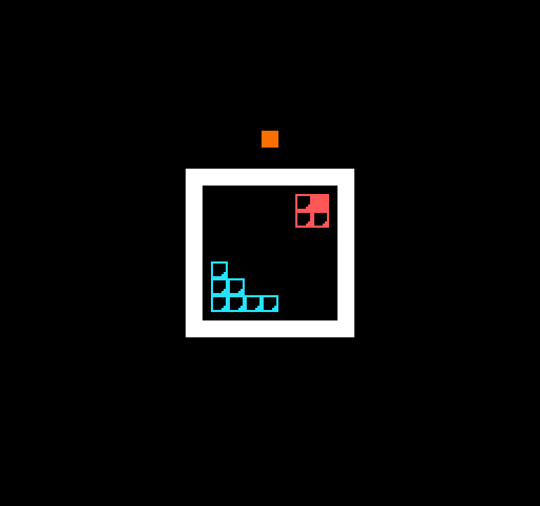

# Tile Wars

Author: pbhuang

Design: Game is based on Dice Wars / Go. Related with Go where you need to capture tiles. Dice wars in that you get dice and you use the number of dice you have on a space to attack other spaces your opponents control (kind of like Risk too). Game is a TWO PLAYER GAME, where turns alternate.

One design compromise that I had to do was my tiles use patterns to indicate strength instead of direct numbers. I had wanted to directly display numbers when my textures were 32x32 and then later 16x16. However for both, I was running into a lot of problems first creating "SuperSprites" consisting of multiple 8x8 sprites to make one of these textures. But also, considering there were only 64 available sprites to be used, if I used 4 for each item, that mean I could only have 64 / 4 = 16 unique pieces drawn at a time, which would make for a very limited gameplay experience. Thus, I decided to put gameplay over graphics so all textures were made to be 8x8.

However with 8x8 textures, I soon found that the textures I had for depiciting numbers were really poor and just didn't have enough fidelity and detail to really discern a 1 vs a 2 vs a 3 etc... very well. Thus I decided to have patterns indicate each strength instead which are easier to see and recognize than Arabic numerals (these are shown down below in the How to Play section).

## Screen Shot:

## How Your Asset Pipeline Works:

My png files were created in Adobe After Effects (because thats what I am most familiar with using for making custom assets). These assets were manually created and placed in an assets/outlines folder. The reason why there was an outlines subfolder is that my original plan was to just have the textures themselves be directly loaded into the game, colors and all. However, This had additional challenges compared to the approach I decided on, which is that I would just used the outline to see which parts of the image are non transparent, and from there then manually fill in a tile struct at those pixels to have a certain color.

These png files are loaded from the assets/outlines folder using the helpful load_png function.

When loading the pngs, I created a palette that had the main colors I would use for the game. The color for player 1 and the color for player 2 were two of the colors in the palette at index 0. Thus, when looking at the outlines, I would simply create a tile where the non transparent parts of the outline would index into palette 0 for the player 1 color, and another tile where the non transparent parts would index into palette 0 for the player 2 color. That was how each asset outline could transformed into a colored sprite in the game.

## Asset files I made:

### Assets currently used in the game:
[Outline1](assets/outlines/outline1.png)  
[Outline2](assets/outlines/outline2.png)  
[Outline3](assets/outlines/outline3.png)  
[Outline4](assets/outlines/outline4.png)  
[Outline5](assets/outlines/outline5.png)  
[Outline6](assets/outlines/outline6.png)  

### Assets I made but unused:

#### 8x8 numbers colored versions:
[Blue Outline 1](assets/1blu.png)
[Blue Outline 2](assets/2blu.png)
[Blue Outline 3](assets/3blu.png)
[Blue Outline 4](assets/4blu.png)
[Blue Outline 5](assets/5blu.png)
[Blue Outline 6](assets/6blu.png)
 

[Red Outline 1](assets/1red.png)
[Red Outline 2](assets/2red.png)
[Red Outline 3](assets/3red.png)
[Red Outline 4](assets/4red.png)
[Red Outline 5](assets/5red.png)
[Red Outline 6](assets/6red.png)

#### 16x16 numbers colored versions:
[Blue Outline 1](assets/16x16/1blu.png)
[Blue Outline 2](assets/16x16/2blu.png)
[Blue Outline 3](assets/16x16/3blu.png)
[Blue Outline 4](assets/16x16/4blu.png)
[Blue Outline 5](assets/16x16/5blu.png)
[Blue Outline 6](assets/16x16/6blu.png)
 

[Red Outline 1](assets/16x16/1red.png)
[Red Outline 2](assets/16x16/2red.png)
[Red Outline 3](assets/16x16/3red.png)
[Red Outline 4](assets/16x16/4red.png)
[Red Outline 5](assets/16x16/5red.png)
[Red Outline 6](assets/16x16/6red.png)

## How To Play:

Tile War is a TWO PLAYER game. Player 1 starts on the bottom left, Player 2 starts on the bottom right

Player 1 is colored light blue 
Player 2 is colored light red 
Selected (tile) is colored orange  
 
Imagine these assets colored light blue or light red (as they are in the game):
 
 
[Strength 1 (has one dot in a corner)](assets/outlines/outline1.png)  
[Strength 2 (has two dots in two corners)](assets/outlines/outline2.png)  
[Strength 3 (has three dots in three corners)](assets/outlines/outline3.png)  
[Strength 4 (has four dots in four corners)](assets/outlines/outline4.png)  
[Strength 5 (has a cross shape)](assets/outlines/outline5.png)  
[Strength 6 (a fully filled in texture (all light blue or light red))](assets/outlines/outline6.png)  

<b>Mouse Click</b>: Select/Deselect pieces  
<b>Enter</b>: End turn
 
 
To select a piece, click on it. It will turn orange to indicate it is selected. To deselect it, click on it again. When a piece is selected, you can click to move it by clicking on a tile directly around it (above, below, left or right).
 
 
There is a single colored tile that is normally orange above the board at the start of the game. At the end of the game, it turns light blue if player 1 wins and light red if player 2 wins.

### Game Rules:
The goal of the game is to cover the [BOARD_SIZE](Game.hpp) x [BOARD_SIZE](Game.hpp) game board with the most tiles at the end of [MAX_TURNS](Game.hpp). You win if at the end of [MAX_TURNS](Game.hpp) you control more tiles than the other player. If you have the same number of tiles, the strength of the tiles you own is compared. If that is also equal then it is a tie game. 

At the start of your turn, your home tile (bottom left for player 1, top right for player 2), is set to strength 6.

Each turn you can select a tile you own with strength larger than one and either:
<ul>
<li> Move half its strength to an adjacent empty tile and take that tile
<li> Move half its strength to an adjacent own tile 
<li> Attack an adjacent enemy tile with half its strength. Your own tile and the enemy tile lose the min of the two tiles' strengths. 
</ul>

At the end of each turn, all tiles you own with strength larger than one lose half their strength.

This game was built with [NEST](NEST.md).

